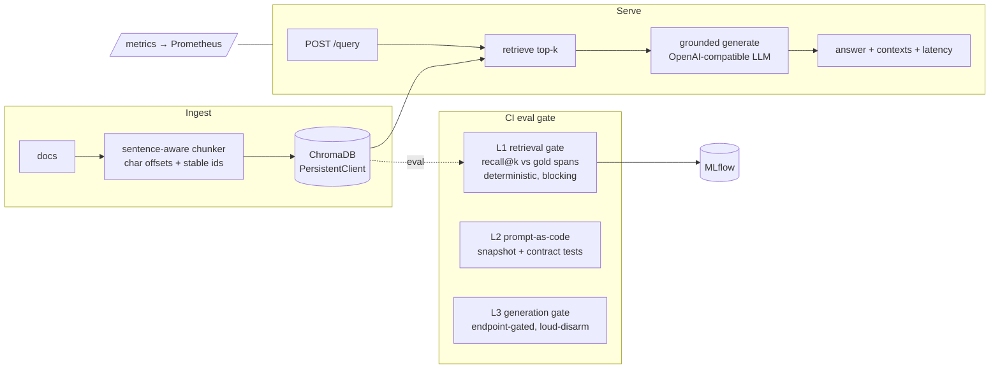

# RAGOps — eval-driven development for a RAG service

**The problem this exists to solve: LLM/RAG systems regress silently.** Change a prompt,
swap an embedding model, or tweak chunking and answer quality can drop with *no error and
no failing test*, because outputs are non-deterministic. Teams ship "small improvements"
that quietly degrade accuracy in production.

**The core idea: make a quality regression fail the build.** RAGOps is a FastAPI RAG
service wrapped in an automated evaluation harness that runs in CI and **exits non-zero —
failing the PR — when retrieval quality drops below a calibrated threshold.** Everything
else (tracking, monitoring, containerization, IaC) exists to support that one guarantee.

---

## The money shot — a regression that can't merge

A contributor opens a PR titled *"perf: retrieve fewer chunks to cut token cost"* — it
changes `TOP_K` from 4 to 1. Nothing errors. Every unit test still passes. But the eval
gate measures that retrieval coverage dropped and **fails the build**:

```
$ python -m eval.retrieval_gate        # clean pipeline on main
{
  "recall_at_1": 0.8421,
  "recall_at_1_wilson_lb": 0.6958,
  "recall_at_k": 1.0,
  ...
}
RETRIEVAL GATE PASSED (thresholds {'recall_at_1_wilson_lb': 0.55, 'recall_at_k': 0.9})
$ echo $?
0

$ TOP_K=1 python -m eval.retrieval_gate   # the "perf" PR — a silent regression
  recall_at_k = 0.8421 < 0.9
RETRIEVAL GATE FAILED: ['recall_at_k']
{
  "recall_at_k": 0.8421,
  ...
  "top_k": 1
}
$ echo $?
1
```

Reproduce it yourself: `make demo-regression`. The full log is in
[docs/money_shot.txt](docs/money_shot.txt). A more dramatic case — swapping the embedding
model — collapses `recall@1` from **0.84 → 0.24**; see the calibration table below.

---

## What this proves (each tied to something actually built)

| Claim | Where it lives | What it actually does |
|---|---|---|
| **Eval-driven development** | `eval/retrieval_gate.py` | Deterministic recall@1 / recall@k gate; exits 1 on regression |
| **I evaluate my own eval** | `eval/calibrate.py`, [docs/gate_calibration.md](docs/gate_calibration.md) | Measures the gate's TPR/FPR against 6 seeded regressions |
| **Statistical honesty** | `eval/metrics.py` | Gates on the **Wilson lower bound**, not a point estimate |
| **CI/CD** | `.github/workflows/ci.yml` | ruff + pytest + docker build + the eval gate, on every PR |
| **Experiment tracking** | `eval/tracking.py` (MLflow) | Logs params + metrics per run; `mlflow ui` shows the trend |
| **Observability** | `app/observability.py`, `monitoring/` | Prometheus metrics + JSON logs + alert rules that watch real failure modes |
| **Containerization** | `Dockerfile` | Multi-stage, non-root, healthcheck, persistent-volume vector store |
| **IaC** | `infra/` | Terraform ECS Fargate skeleton — **validated, never applied** (honestly labeled) |

I do **not** claim: a production deployment, RAGAS/LLM-judge metrics (deliberately kept out
of the merge gate — see *Design choices*), or human-validated answer quality at scale.

---

## Architecture



The retrieval core is intentionally small and swappable; the value is the wrapper around it.

## The three-layer gate — and why three

A single "answer accuracy" check in CI is either flaky (LLM nondeterminism) or can't fire.
RAGOps splits the guarantee into layers by *what each can catch deterministically*:

- **L1 — retrieval gate (`eval/retrieval_gate.py`), blocking on every PR incl. forks.**
  No LLM, no secrets. Scores `recall@1` and `recall@k` against **gold spans** (a labeled
  character range in the source doc), so it's fully deterministic and reproducible. This
  is the centerpiece.
- **L2 — prompt-as-code (`tests/test_prompts.py`, `tests/test_rag.py`).** The system
  prompt is snapshot-tested; behavioral contracts (grounding, empty-context handling) run
  with the LLM stubbed. A silent prompt edit now fails CI like any code change.
- **L3 — generation gate (`eval/answer_gate.py`), endpoint-gated.** Answer accuracy +
  refusal accuracy on unanswerable questions, gated at a low *catastrophe* floor via the
  Wilson bound. When no LLM endpoint is reachable it prints a **loud DISARMED banner and
  passes** — it never silently skips, so a green build is never mistaken for "generation
  verified."

## Evaluating the eval (this is the differentiating part)

A gate you can't trust teaches people to ignore it. `eval/calibrate.py` injects known
regressions and measures whether the gate fires — a true/false-positive rate for the gate
itself. Current result (regenerate with `make calibrate`):

<!-- see docs/gate_calibration.md for the generated table -->
**TPR 4/4 = 100% · FPR 0/2 = 0%.** The gate fires on the embedding swap, embedding
collapse, corpus truncation, and low top_k; it correctly stays green on a clean run and on
over-fragmented chunks (whose harm is generation-side, not retrieval — an honest scope
boundary). Full table: [docs/gate_calibration.md](docs/gate_calibration.md).

## Quickstart

```bash
make install            # venv + pinned deps (installs on Python 3.12 and 3.14)
make test               # 28 offline tests, no LLM needed
make gate               # run the deterministic retrieval gate
make calibrate          # evaluate the eval → docs/gate_calibration.md
make demo-regression    # watch the gate go green then RED

# Serve + query against a local, free LLM (LM Studio at :1234), zero cloud cost:
make run
curl -s localhost:8000/query -H 'content-type: application/json' \
  -d '{"question":"How much does the Team plan cost?"}' | jq
```

`mlflow ui` (from the repo root) shows every eval run's params and metrics as a trend.
`docker compose up` runs the service + Prometheus (with alert rules); the vector index is
on a named volume, so `/ingest` survives a restart.

## The corpus and eval set

`eval/corpus/` is a controlled 10-document corpus with deliberate near-duplicate distractors
(v1 vs v2 API, per-tier billing/limits). It's controlled on purpose: **I own the ground
truth, which is what makes `recall@k` exact and the gate trustworthy.** `eval/dataset.jsonl`
has 42 questions (38 answerable + 4 unanswerable), stratified into answerable, paraphrase,
`fixed_bug` (v1/v2 disambiguation — regression tests), and unanswerable (refusal) cases,
each labeled with a gold quote resolved to a span. Point RAGOps at your own docs by dropping
markdown in `CORPUS_DIR` and labeling questions the same way — the harness is corpus-agnostic.

## Design choices worth defending in an interview

- **Gold *spans*, not "keyword appears in context."** The naive check saturates at 1.0 on a
  small corpus and can never fail. Span overlap is source-aware (a chunk from another file
  with the same offsets is not a hit) — this was a real bug the calibration harness caught.
- **`recall@1` as the primary metric.** On a lexically-distinct corpus `recall@k` saturates,
  so it's insensitive; `recall@1` moves when rank quality degrades (e.g. a worse embedding).
- **Wilson lower bound for thresholds.** Answers "how do you know 0.78 vs 0.80 isn't noise?"
  with one whiteboard-derivable formula, instead of a variance estimate from too few runs.
- **No RAGAS / LLM-judge in the blocking gate.** A nondeterministic judge in a merge gate
  reintroduces exactly the flakiness this project exists to remove. Kept as possible offline
  analysis, not a gate.
- **Number-word canonicalization + word-boundary alias matching.** So a model that answers
  "3" isn't marked wrong for gold "three", and "99" doesn't match inside "499".

## Limitations (what the gate cannot catch)

- **L1 is retrieval-only.** It won't catch a prompt that ignores its context or a model that
  hallucinates fluently over correct chunks — that's L2 (prompt snapshot) and L3 (generation).
- **Small-n resolution.** With n=38, the recall@1 Wilson interval is roughly ±0.15; the gate
  detects meaningful regressions, not 2-point wobble. Thresholds sit well below baseline by
  design (see the wide margin to the seeded regressions).
- **Controlled corpus.** Metrics prove the *harness* works; real-world answer quality depends
  on your corpus and model. Swapping in a large real corpus is a config change, not a rewrite.
- **Terraform is unapplied** and single-task (see `infra/main.tf` for the state caveat).

## Reproducibility

Requires Python 3.12+ (CI uses 3.12; also verified on 3.14). Dependencies are pinned in
`requirements.txt`. The original scaffold pinned `mlflow==2.16.2`, which pulled a `pyarrow`
with no wheel for current Python and failed to install; the pins here install cleanly. The
embedding model (ONNX MiniLM-L6-v2, ~80 MB) downloads once and is cached; CI caches it too.
```
